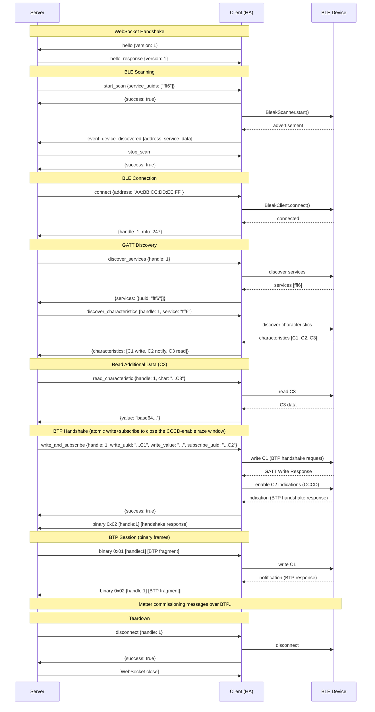

# BLE Proxy WebSocket Protocol

Version: 1.0

## Overview

The BLE Proxy Protocol enables a Matter controller server to perform Bluetooth Low Energy (BLE)
operations through a remote BLE-capable host. The protocol runs over a WebSocket connection and
supports BLE scanning, GATT service discovery, characteristic read/write/subscribe operations,
and efficient binary data transfer for BLE Transport Protocol (BTP) communication.

The primary use case is Home Assistant proxying BLE operations (via local adapters or ESPHome
BLE proxies) to a Matter.js server for BLE-based device commissioning.

## Transport

- **WebSocket** connection on the same host and port as the main Matter server WebSocket,
  but on the `/ble` path (e.g. `ws://host:5580/ble`)
- **Text frames** carry JSON control messages (commands, responses, events)
- **Binary frames** carry high-throughput characteristic data (writes and notifications)
- The BLE proxy client (e.g. Home Assistant) connects to the server endpoint

## Terminology

| Term                  | Definition                                                                 |
|-----------------------|----------------------------------------------------------------------------|
| **Server**            | The Matter controller server hosting the `/ble` WebSocket endpoint         |
| **Client**            | The BLE proxy client (e.g. Home Assistant) that has access to BLE hardware |
| **Peripheral**        | A BLE device being scanned for or connected to                             |
| **Connection Handle** | A client-assigned integer identifying an active BLE connection             |

## Connection Lifecycle

1. The server exposes the `/ble` WebSocket endpoint accepting a single client connection
2. The client connects as soon as BLE is available, latest when BLE operations are needed (e.g., at commissioning time)
3. The client sends a `hello` handshake message (see below)
4. The server responds with `hello_response` confirming the protocol version
5. The server sends commands; the client executes them against BLE hardware and responds
6. Either side may close the WebSocket when BLE operations are complete
7. The client should clean up all active BLE connections when the WebSocket closes

Only one client connection is allowed at a time. If a second client attempts to connect while
one is already active, the server rejects the new connection.

### Handshake

Immediately after the WebSocket connection is established, the client must send a `hello`
message. The server responds with `hello_response`. No other messages may be sent before
the handshake completes.

**Client -> Server:**
```json
{
  "type": "hello",
  "version": 1
}
```

**Server -> Client (success):**
```json
{
  "type": "hello_response",
  "version": 1
}
```

**Server -> Client (version mismatch):**
```json
{
  "type": "hello_response",
  "version": 1,
  "error": "unsupported_version",
  "message": "Server supports protocol version 1, client sent version 2"
}
```

| Field     | Type    | Required | Description                                                 |
|-----------|---------|----------|-------------------------------------------------------------|
| `type`    | string  | yes      | `"hello"` or `"hello_response"`                             |
| `version` | integer | yes      | Protocol version number. Currently `1`                      |
| `error`   | string  | no       | Present on `hello_response` if the version is not supported |
| `message` | string  | no       | Human-readable error description                            |

If the server does not support the client's version, it sends an error `hello_response` and
closes the WebSocket. If the handshake is not received within 10 seconds, the server should
close the connection.

## JSON Message Format

All JSON messages are sent as text WebSocket frames containing a single JSON object.

### Commands (Server -> Client)

The server sends commands requesting BLE operations. Each command has a unique `id`.

```json
{
  "id": <integer>,
  "command": "<string>",
  "args": { ... }
}
```

| Field     | Type    | Required | Description                                                    |
|-----------|---------|----------|----------------------------------------------------------------|
| `id`      | integer | yes      | Unique message ID, monotonically increasing                    |
| `command` | string  | yes      | Command name (see Commands section)                            |
| `args`    | object  | no       | Command-specific arguments. Omit if command takes no arguments |

### Responses (Client -> Server)

The client sends exactly one response for each command, using the same `id`.

**Success response:**
```json
{
  "id": <integer>,
  "success": true,
  "result": { ... }
}
```

**Error response:**
```json
{
  "id": <integer>,
  "success": false,
  "error": "<string>",
  "message": "<string>"
}
```

| Field     | Type    | Required   | Description                                                     |
|-----------|---------|------------|-----------------------------------------------------------------|
| `id`      | integer | yes        | Matches the command `id`                                        |
| `success` | boolean | yes        | Whether the command succeeded                                   |
| `result`  | object  | on success | Command-specific result data. May be `{}` or omitted if no data |
| `error`   | string  | on failure | Machine-readable error code                                     |
| `message` | string  | on failure | Human-readable error description                                |

### Events (Client -> Server)

The client sends unsolicited events to notify the server of asynchronous BLE occurrences.

```json
{
  "event": "<string>",
  "data": { ... }
}
```

| Field   | Type   | Required | Description                     |
|---------|--------|----------|---------------------------------|
| `event` | string | yes      | Event name (see Events section) |
| `data`  | object | yes      | Event-specific data             |

## Commands

### start_scan

Start scanning for BLE devices. The client should send `device_discovered` events for each
device found matching the filter criteria.

**Args:**

| Field              | Type     | Required | Default    | Description                                                           |
|--------------------|----------|----------|------------|-----------------------------------------------------------------------|
| `service_uuids`    | string[] | no       | `[]` (all) | Filter by advertised service UUIDs (16-bit short form, e.g. `"fff6"`) |
| `allow_duplicates` | boolean  | no       | `true`     | If true, report the same device multiple times (updated RSSI/data)    |

**Result:** `{}` (empty)

**Errors:**

| Error Code              | Description                     |
|-------------------------|---------------------------------|
| `bluetooth_unavailable` | No Bluetooth adapters available |
| `already_scanning`      | A scan is already in progress   |

**Notes:**
- Only one scan can be active at a time
- The client should start sending `device_discovered` events after responding with success
- Scanning continues until `stop_scan` is sent or the WebSocket closes

---

### stop_scan

Stop an active BLE scan.

**Args:** none

**Result:** `{}` (empty)

**Errors:**

| Error Code     | Description                 |
|----------------|-----------------------------|
| `not_scanning` | No scan is currently active |

---

### connect

Connect to a BLE peripheral by address.

**Args:**

| Field     | Type   | Required | Description                                          |
|-----------|--------|----------|------------------------------------------------------|
| `address` | string | yes      | Peripheral MAC address (e.g. `"AA:BB:CC:DD:EE:FF"`)  |
| `timeout` | number | no       | Connection timeout in milliseconds (default: 30_000) |

**Result:**

| Field               | Type    | Description                                |
|---------------------|---------|--------------------------------------------|
| `connection_handle` | integer | Client-assigned handle for this connection |
| `mtu`               | integer | Negotiated ATT MTU size                    |

The `connection_handle` is assigned by the client and must be unique across all active
connections. It is used in all subsequent commands and binary frames for this connection.

**Errors:**

| Error Code          | Description                                 |
|---------------------|---------------------------------------------|
| `device_not_found`  | Peripheral not reachable or not advertising |
| `connection_failed` | Connection attempt failed                   |
| `already_connected` | Already connected to this address           |
| `timeout`           | Connection timed out                        |

---

### disconnect

Disconnect from a connected peripheral.

**Args:**

| Field               | Type    | Required | Description                    |
|---------------------|---------|----------|--------------------------------|
| `connection_handle` | integer | yes      | Handle from `connect` response |

**Result:** `{}` (empty)

**Errors:**

| Error Code      | Description                           |
|-----------------|---------------------------------------|
| `not_connected` | No active connection with this handle |

---

### discover_services

Discover all GATT services on a connected peripheral.

**Args:**

| Field               | Type    | Required | Description                    |
|---------------------|---------|----------|--------------------------------|
| `connection_handle` | integer | yes      | Handle from `connect` response |

**Result:**

| Field      | Type     | Description                  |
|------------|----------|------------------------------|
| `services` | object[] | Array of discovered services |

Each service object:

| Field  | Type   | Description                                                                                                        |
|--------|--------|--------------------------------------------------------------------------------------------------------------------|
| `uuid` | string | Service UUID (uppercase, with dashes for 128-bit: `"0000FFF6-0000-1000-8000-00805F9B34FB"` or short form `"fff6"`) |

**Errors:**

| Error Code         | Description                           |
|--------------------|---------------------------------------|
| `not_connected`    | No active connection with this handle |
| `discovery_failed` | Service discovery failed              |

---

### discover_characteristics

Discover characteristics for a specific GATT service.

**Args:**

| Field               | Type    | Required | Description                                  |
|---------------------|---------|----------|----------------------------------------------|
| `connection_handle` | integer | yes      | Handle from `connect` response               |
| `service_uuid`      | string  | yes      | Service UUID to discover characteristics for |

**Result:**

| Field             | Type     | Description                         |
|-------------------|----------|-------------------------------------|
| `characteristics` | object[] | Array of discovered characteristics |

Each characteristic object:

| Field        | Type     | Description                                                                           |
|--------------|----------|---------------------------------------------------------------------------------------|
| `uuid`       | string   | Characteristic UUID                                                                   |
| `properties` | string[] | Properties: `"read"`, `"write"`, `"write-without-response"`, `"notify"`, `"indicate"` |

**Errors:**

| Error Code          | Description                           |
|---------------------|---------------------------------------|
| `not_connected`     | No active connection with this handle |
| `service_not_found` | Specified service UUID not found      |
| `discovery_failed`  | Characteristic discovery failed       |

---

### read_characteristic

Read the current value of a characteristic.

**Args:**

| Field                 | Type    | Required | Description                    |
|-----------------------|---------|----------|--------------------------------|
| `connection_handle`   | integer | yes      | Handle from `connect` response |
| `characteristic_uuid` | string  | yes      | Characteristic UUID to read    |

**Result:**

| Field   | Type   | Description                         |
|---------|--------|-------------------------------------|
| `value` | string | Base64-encoded characteristic value |

For large or frequent reads, the client may alternatively send a binary frame with
opcode `0x03` instead of a JSON result (see in the Binary Frames section).

**Errors:**

| Error Code                 | Description                             |
|----------------------------|-----------------------------------------|
| `not_connected`            | No active connection with this handle   |
| `characteristic_not_found` | Specified characteristic UUID not found |
| `read_failed`              | Read operation failed                   |

---

### write_characteristic

Write a value to a characteristic. Used for small or infrequent writes. For high-throughput
writes (e.g. BTP data on characteristic C1), use binary frames with opcode `0x01` instead.

**Args:**

| Field                 | Type    | Required | Description                                       |
|-----------------------|---------|----------|---------------------------------------------------|
| `connection_handle`   | integer | yes      | Handle from `connect` response                                                 |
| `characteristic_uuid` | string  | yes      | Characteristic UUID to write                                                   |
| `value`               | string  | yes      | Base64-encoded value to write                                                  |
| `response`            | boolean | no       | `true` → ATT Write Request (acknowledged); `false` → Write Without Response. Default `false`. Matter BTP writes to C1 MUST set `true` (C1 typically does not advertise `write-without-response`). |

**Result:** `{}` (empty)

**Errors:**

| Error Code                 | Description                             |
|----------------------------|-----------------------------------------|
| `not_connected`            | No active connection with this handle   |
| `characteristic_not_found` | Specified characteristic UUID not found |
| `write_failed`             | Write operation failed                  |

---

### subscribe_characteristic

Subscribe to notifications or indications on a characteristic. After subscribing, the client
sends notification data as binary frames with opcode `0x02`, or as `characteristic_notification`
events for small/infrequent data.

**Args:**

| Field                 | Type    | Required | Description                         |
|-----------------------|---------|----------|-------------------------------------|
| `connection_handle`   | integer | yes      | Handle from `connect` response      |
| `characteristic_uuid` | string  | yes      | Characteristic UUID to subscribe to |

**Result:** `{}` (empty)

After a successful response, the client must forward all notifications from this characteristic
to the server. Binary frames (opcode `0x02`) are preferred for throughput.

**Errors:**

| Error Code                 | Description                                   |
|----------------------------|-----------------------------------------------|
| `not_connected`            | No active connection with this handle         |
| `characteristic_not_found` | Specified characteristic UUID not found       |
| `subscribe_failed`         | Subscribe operation failed                    |
| `notify_not_supported`     | Characteristic does not support notifications |

---

### write_and_subscribe

Atomically write to one characteristic, then enable notifications on another, without any
intervening WebSocket round-trip. Used for the Matter BTP handshake: the server writes the
BTP handshake request to C1 and must enable indications on C2 before the peripheral pushes
the handshake response. Splitting this across `write_characteristic` +
`subscribe_characteristic` adds a WebSocket round-trip during which an early indication is
lost on stacks that hand off notifications atomically with CCCD enable (e.g. CoreBluetooth on
macOS via Bleak).

The client MUST perform the write, await the GATT Write Response, and only then issue the
CCCD enable for the subscribe characteristic. Both operations run in a single client-side
task; the response is sent after both succeed.

**Args:**

| Field               | Type    | Required | Description                                                                                                                                                                                       |
|---------------------|---------|----------|---------------------------------------------------------------------------------------------------------------------------------------------------------------------------------------------------|
| `connection_handle` | integer | yes      | Handle from `connect` response                                                                                                                                                                    |
| `write_uuid`        | string  | yes      | Characteristic UUID to write to (typically C1)                                                                                                                                                    |
| `write_value`       | string  | yes      | Base64-encoded value to write                                                                                                                                                                     |
| `write_response`    | boolean | no       | `true` → ATT Write Request (acknowledged); `false` → Write Without Response. Default `false`. Matter BTP writes to C1 MUST set `true`.                                                            |
| `subscribe_uuid`    | string  | yes      | Characteristic UUID to enable notifications/indications on (typically C2)                                                                                                                         |

**Result:** `{}` (empty)

After a successful response, the `subscribe_uuid` is treated identically to a successful
`subscribe_characteristic`: all subsequent notifications are forwarded to the server
(binary opcode `0x02` preferred), and `unsubscribe_characteristic` is the matching teardown.

**Errors:**

| Error Code                 | Description                                   |
|----------------------------|-----------------------------------------------|
| `not_connected`            | No active connection with this handle         |
| `characteristic_not_found` | One of the specified UUIDs not found          |
| `write_failed`             | Write operation failed                        |
| `subscribe_failed`         | Subscribe operation failed                    |
| `notify_not_supported`     | Subscribe characteristic does not support notifications |

---

### unsubscribe_characteristic

Unsubscribe from notifications on a characteristic.

**Args:**

| Field                 | Type    | Required | Description                             |
|-----------------------|---------|----------|-----------------------------------------|
| `connection_handle`   | integer | yes      | Handle from `connect` response          |
| `characteristic_uuid` | string  | yes      | Characteristic UUID to unsubscribe from |

**Result:** `{}` (empty)

**Errors:**

| Error Code                 | Description                                     |
|----------------------------|-------------------------------------------------|
| `not_connected`            | No active connection with this handle           |
| `characteristic_not_found` | Specified characteristic UUID not found         |
| `not_subscribed`           | Not currently subscribed to this characteristic |

---

### request_mtu

Request a specific ATT MTU size for the connection. The actual negotiated MTU may be smaller.

**Args:**

| Field               | Type    | Required | Description                    |
|---------------------|---------|----------|--------------------------------|
| `connection_handle` | integer | yes      | Handle from `connect` response |
| `mtu`               | integer | yes      | Requested MTU size in bytes    |

**Result:**

| Field | Type    | Description                |
|-------|---------|----------------------------|
| `mtu` | integer | Actual negotiated MTU size |

**Errors:**

| Error Code           | Description                           |
|----------------------|---------------------------------------|
| `not_connected`      | No active connection with this handle |
| `mtu_request_failed` | MTU negotiation failed                |

## Events

### device_discovered

Sent when a BLE device is discovered during scanning.

**Data:**

| Field               | Type     | Required | Description                                                                  |
|---------------------|----------|----------|------------------------------------------------------------------------------|
| `address`           | string   | yes      | Peripheral MAC address                                                       |
| `name`              | string   | no       | Local device name from advertisement                                         |
| `rssi`              | integer  | no       | Signal strength in dBm                                                       |
| `connectable`       | boolean  | yes      | Whether the device is connectable                                            |
| `service_data`      | object   | no       | Map of service UUID -> base64-encoded data (e.g. `{"fff6": "AAAPoff/AYA="}`) |
| `manufacturer_data` | object   | no       | Map of manufacturer ID (string) -> base64-encoded data                       |
| `service_uuids`     | string[] | no       | List of advertised service UUIDs                                             |

**Notes:**
- `service_data` keys SHOULD be the 16-bit short form for standard Bluetooth UUIDs (e.g.
  `"fff6"`). The server accepts any case and also accepts the full 128-bit form (with or
  without dashes) and matches against the Matter Service UUID regardless.
- For Matter device discovery, the critical field is service data keyed by the Matter
  Service UUID (`fff6` / `0000fff6-0000-1000-8000-00805f9b34fb`), containing the 8-byte
  Matter BLE advertisement payload (discriminator, vendor/product ID, etc.)

### UUID format

UUIDs in this protocol — service UUIDs, characteristic UUIDs, `service_data` keys, and the
strings inside `service_uuids` — accept ANY of these forms. Implementations SHOULD send
whatever is natural for their BLE stack; the server normalizes before comparison:

- Short form for standard Bluetooth UUIDs: `"fff6"` or `"FFF6"`
- 128-bit canonical form, either case: `"18EE2EF5-263D-4559-959F-4F9C429F9D11"` or
  `"18ee2ef5-263d-4559-959f-4f9c429f9d11"`
- 128-bit compact form (no dashes), either case: `"18ee2ef5263d4559959f4f9c429f9d11"` —
  this is what `@stoprocent/noble` emits.

---

### disconnected

Sent when a peripheral disconnects unexpectedly (not initiated by a `disconnect` command).

**Data:**

| Field               | Type    | Required | Description                           |
|---------------------|---------|----------|---------------------------------------|
| `connection_handle` | integer | yes      | Handle of the disconnected connection |
| `reason`            | string  | no       | Human-readable disconnect reason      |

After sending this event, the client should clean up all state associated with this
connection handle. The server should not send further commands for this handle.

---

### scan_stopped

Sent when scanning stops unexpectedly (not initiated by a `stop_scan` command).

**Data:**

| Field    | Type   | Required | Description                                                        |
|----------|--------|----------|--------------------------------------------------------------------|
| `reason` | string | yes      | Reason for stopping (e.g. `"adapter_off"`, `"proxy_disconnected"`) |

---

### characteristic_notification

Alternative to binary frame opcode `0x02` for infrequent or small notification data.
Binary frames are preferred for throughput-sensitive paths (BTP communication).

**Data:**

| Field                 | Type    | Required | Description                          |
|-----------------------|---------|----------|--------------------------------------|
| `connection_handle`   | integer | yes      | Handle of the connection             |
| `characteristic_uuid` | string  | yes      | UUID of the notifying characteristic |
| `value`               | string  | yes      | Base64-encoded notification value    |

## Binary Frames

Binary WebSocket frames are used for high-throughput characteristic data transfer, primarily
for BTP (BLE Transport Protocol) communication during Matter commissioning.

### Frame Format

```
Byte:  0         1         2         3         4    ...    N
     +--------+---------+---------+---------+---------+
     | opcode | conn_hi | conn_lo | payload ...       |
     +--------+---------+---------+---------+---------+
```

| Offset | Size    | Field               | Description                                  |
|--------|---------|---------------------|----------------------------------------------|
| 0      | 1 byte  | `opcode`            | Operation type (see below)                   |
| 1      | 2 bytes | `connection_handle` | Big-endian unsigned 16-bit connection handle |
| 3      | N bytes | `payload`           | Raw binary data                              |

Minimum frame size: 3 bytes (opcode and handle, empty payload).

### Opcodes

| Opcode | Name            | Direction        | Description                                        |
|--------|-----------------|------------------|----------------------------------------------------|
| `0x01` | `WRITE_DATA`    | server -> client | Write payload to the active write characteristic   |
| `0x02` | `NOTIFICATION`  | client -> server | Notification data from a subscribed characteristic |
| `0x03` | `READ_RESPONSE` | client -> server | Response data for a `read_characteristic` command  |

### Characteristic Context

Binary frames do not include the characteristic UUID. The characteristic context is established
by the preceding JSON command:

- **`WRITE_DATA` (0x01):** Writes to the characteristic most recently targeted by a
  `write_characteristic` JSON command for this connection handle. In practice, this is always
  the Matter BTP characteristic C1 (`18EE2EF5-263D-4559-959F-4F9C429F9D11`). Clients MUST use
  ATT Write Request (with response) for these writes — same constraint as the initial
  `write_characteristic` handshake on C1.

- **`NOTIFICATION` (0x02):** Contains data from the characteristic most recently subscribed
  via `subscribe_characteristic` for this connection handle. In practice, this is always
  the Matter BTP characteristic C2 (`18EE2EF5-263D-4559-959F-4F9C429F9D12`).

- **`READ_RESPONSE` (0x03):** Contains the response to the most recent `read_characteristic`
  command for this connection handle. Used as an alternative to the JSON result when the
  client prefers binary delivery.

### When to Use Binary vs JSON

| Operation                                    | Recommended Format                 | Rationale                           |
|----------------------------------------------|------------------------------------|-------------------------------------|
| BTP writes (C1)                              | Binary (`0x01`)                    | High frequency during commissioning |
| BTP notifications (C2)                       | Binary (`0x02`)                    | High frequency during commissioning |
| C3 characteristic read                       | JSON result                        | One-time read, small payload        |
| Initial characteristic write (BTP handshake) | JSON `write_and_subscribe`         | Establishes binary context; combo avoids CCCD-enable race |
| Infrequent notifications                     | JSON `characteristic_notification` | Low frequency, simpler              |

## Matter BLE Commissioning Sequence

This section illustrates a typical Matter BLE commissioning flow using the protocol.
UUIDs reference the Matter BLE specification.



## Error Codes Reference

| Error Code                 | Description                                     |
|----------------------------|-------------------------------------------------|
| `bluetooth_unavailable`    | No Bluetooth adapters or proxies available      |
| `already_scanning`         | A scan is already in progress                   |
| `not_scanning`             | No scan is currently active                     |
| `device_not_found`         | Peripheral not reachable or not advertising     |
| `connection_failed`        | BLE connection attempt failed                   |
| `already_connected`        | Already connected to this peripheral            |
| `not_connected`            | No active connection with this handle           |
| `timeout`                  | Operation timed out                             |
| `service_not_found`        | Specified service UUID not found on device      |
| `characteristic_not_found` | Specified characteristic UUID not found         |
| `read_failed`              | Characteristic read operation failed            |
| `write_failed`             | Characteristic write operation failed           |
| `subscribe_failed`         | Characteristic subscribe operation failed       |
| `not_subscribed`           | Not currently subscribed to this characteristic |
| `notify_not_supported`     | Characteristic does not support notifications   |
| `mtu_request_failed`       | MTU negotiation failed                          |
| `discovery_failed`         | Service or characteristic discovery failed      |
| `internal_error`           | Unexpected internal error on the client side    |

## Matter BLE Constants

For reference, these are the Matter BLE UUIDs used during commissioning:

| Name               | UUID                                                   | Purpose                              |
|--------------------|--------------------------------------------------------|--------------------------------------|
| Matter BLE Service | `0000FFF6-0000-1000-8000-00805F9B34FB` (short: `fff6`) | Matter BLE service                   |
| Characteristic C1  | `18EE2EF5-263D-4559-959F-4F9C429F9D11`                 | BTP write (server writes to device)  |
| Characteristic C2  | `18EE2EF5-263D-4559-959F-4F9C429F9D12`                 | BTP notify (device notifies server)  |
| Characteristic C3  | `18EE2EF5-263D-4559-959F-4F9C429F9D13`                 | Additional commissioning data (read) |

## Security Considerations

- The `/ble` endpoint is intended for localhost or trusted network access only
  (same security model as the main `/ws` endpoint)
- No authentication is built into the protocol; rely on network-level security
- The client should validate that BLE operations are only performed for legitimate
  Matter commissioning (not arbitrary BLE device access)
- Binary frame payloads are unencrypted; encryption is handled at the Matter protocol
  layer (CASE/PASE session establishment during commissioning)
